# GNS3 Lab: GRE Tunnel Implementation

## Table of Contents
- [Overview](#overview)
- [Lab Topology](#lab-topology)
- [Objective](#objective)
- [Configuration Steps](#configuration-steps)
- [Verification](#verification)
- [Conclusion](#conclusion)

## Overview
This repository documents a GNS3 lab demonstrating the configuration and verification of a Generic Routing Encapsulation (GRE) tunnel. The lab establishes a secure and routable path between two remote networks over an insecure public network.

## Lab Topology

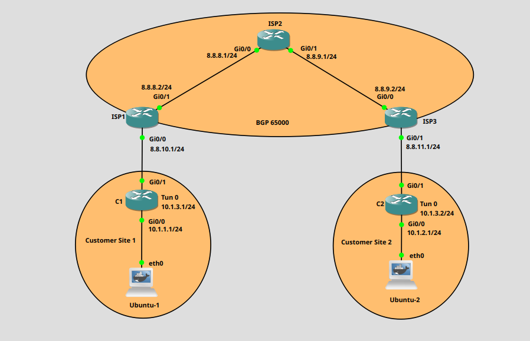

*(In my Lab I made use of "Two Cisco IOSv routers (C1, C2) connected via three Cisco IOSV routers acting as an 'ISP' cloud. Each router(C1 and C2) has a LAN segment behind it with an Ubuntu client connected to each router (c1 and C2).")*

## Objective
The primary objectives of this lab were:
1.  Configure basic IP addressing on all devices.
2.  Establish a GRE tunnel between Customer site1(C1) and Customer site2(C2).
3.  Configure routing (e.g., static routes or OSPF/EIGRP) over the GRE tunnel.
4.  Verify end-to-end connectivity through the tunnel.

## Configuration Steps

### C1 Configuration
c1(config-if)#int g0/1      
c1(config-if)#ip add dhcp
c1(config-if)#no sh
c1(config-if)#int g0/0 
c1(config-if)#ip add 10.1.1.1 255.255.255.0
c1(config-if)#no sh

c1#conf t
c1(config)#ip dhcp pool CS1_pool
c1(dhcp-config)#network 10.1.1.0 255.255.255.0
c1(dhcp-config)#default-router 10.1.1.1

c1(config)#int tunnel 0
c1(config-if)#ip add 10.1.3.1 255.255.255.0
c1(config-if)#tunnel source g0/1
c1(config-if)#tunnel destination 8.8.11.4

c1(config)#router ospf 100
c1(config-router)#network 10.1.0.0 0.0.255.255 area 0

## C1 Router Snipshots

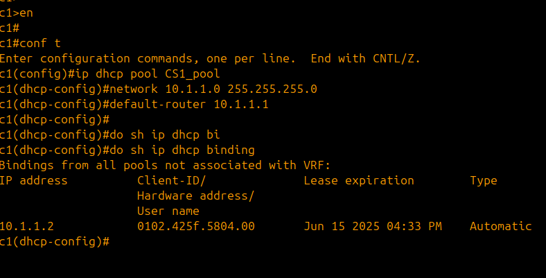
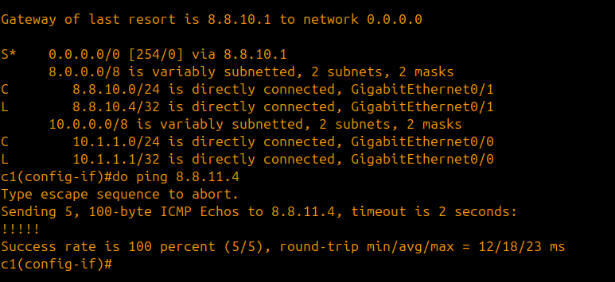
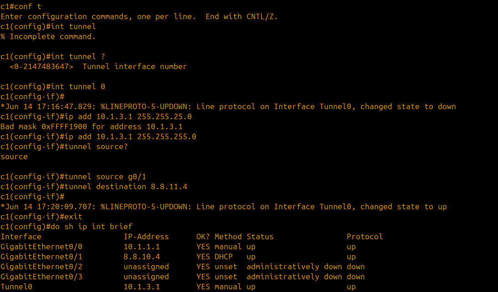
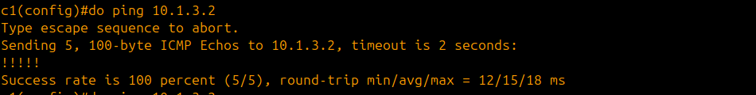
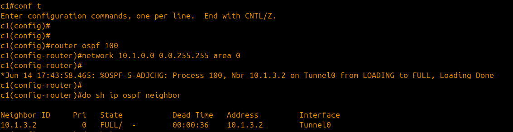
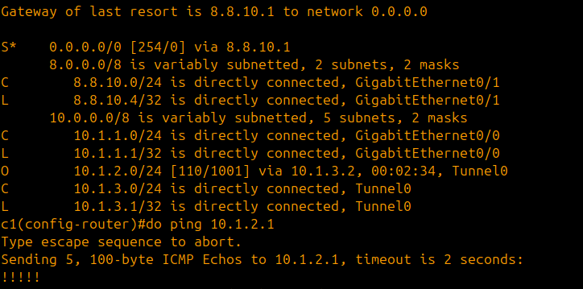

### C2 Configuration
c2(config-if)#int g0/1      
c2(config-if)#ip add dhcp
c2(config-if)#no sh
c2(config-if)#int g0/0
c2(config-if)#ip add 10.1.2.1 255.255.255.0
c2(config-if)#no sh

c2#conf t
c2(config)#ip dhcp pool CS1_pool
c2(dhcp-config)#network 10.1.2.0 255.255.255.0
c2(dhcp-config)#default-router 10.1.2.1

c2(config)#int tunnel 0
c2(config-if)#ip add 10.1.3.2 255.255.255.0
c2(config-if)#tunnel source g0/1
c2(config-if)#tunnel destination 8.8.10.4

c2(config)#router ospf 100
c2(config-router)#network 10.1.0.0 0.0.255.255 area 0

## C2 Router Snipshots

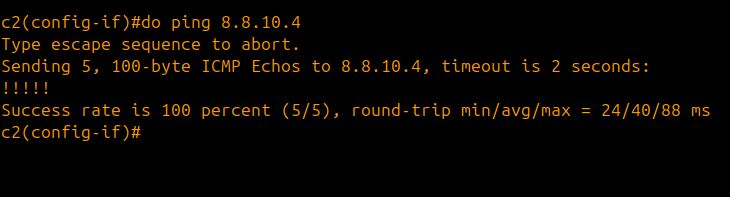

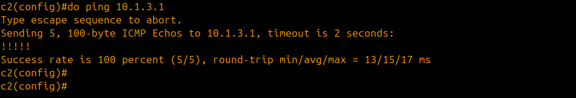

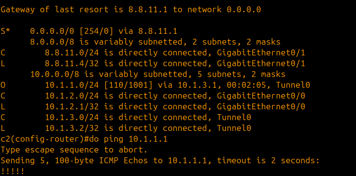

### ISP1 Configuration
ISP1(config)#int g0/0
ISP1(config-if)#ip address 8.8.10.1 255.255.255.0
ISP1(config-if)#no sh
ISP1(config)#int g0/1
ISP1(config-if)#ip address 8.8.8.2 255.255.255.0

ISP1(config-if)#no sh

ISP1(config)#ip dhcp pool customers
ISP1(dhcp-config)#network 8.8.10.0 255.255.255.0
ISP1(dhcp-config)#default-router 8.8.10.1
ISP1(dhcp-config)#dns-server 8.8.8.1

ISP1(config)#router ospf 1
ISP1(config-router)#network 8.8.8.2 0.0.0.0 area 0

ISP1(config)#router bgp 65000
ISP1(config)#neighbor 8.8.8.1 remote-as 65000
ISP1(config)#neighbor 8.8.9.2 remote-as 65000

### ISP2 Configuration
ISP2(config)#int g0/0
ISP2(config-if)#ip address 8.8.8.1 255.255.255.0
ISP2(config-if)#no sh
ISP2(config)#int g0/1
ISP2(config-if)#ip address 8.8.9.1 255.255.255.0
ISP2(config-if)#no sh

ISP2(config)#router ospf 1
ISP2(config-router)#network 0.0.0.0 0.0.0.0 area 0

ISP2(config)#router bgp 65000
ISP2(config)#neighbor 8.8.8.2 remote-as 65000
ISP2(config)#neighbor 8.8.9.2 remote-as 65000

### ISP3 Configuration
ISP3(config)#int g0/0
ISP3(config-if)#ip address 8.8.9.2 255.255.255.0
ISP3(config-if)#no sh
ISP3(config)#int g0/1
ISP3(config-if)#ip address 8.8.11.1 255.255.255.0
ISP3(config-if)#no sh

ISP3(config)#ip dhcp pool customers
ISP3(dhcp-config)#network 8.8.11.0 255.255.255.0
ISP3(dhcp-config)#default-router 8.8.11.1 
ISP3(dhcp-config)#dns-server 8.8.8.1 

ISP3(config)#router ospf 1
ISP3(config-router)#network 8.8.9.2 0.0.0.0 area 0

ISP3(config)#router bgp 65000
ISP3(config)#neighbor 8.8.8.2 remote-as 65000
ISP3(config)#neighbor 8.8.9.1 remote-as 65000

### VERIFICATIONS

## ISPs Routing Table not learning anything about the Tunnel Ip Address

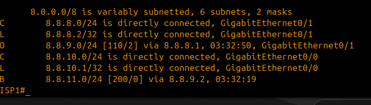
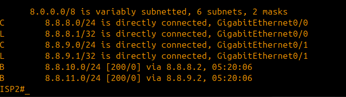

## Snapshot from wireshark showing the GRE being encapsulated in the IP

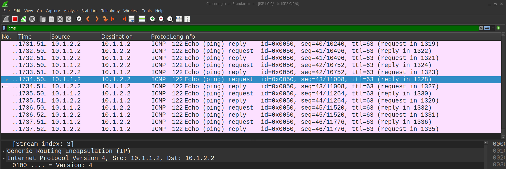

## Snapshot of pings between Ubuntu clients on the 2 customer sites
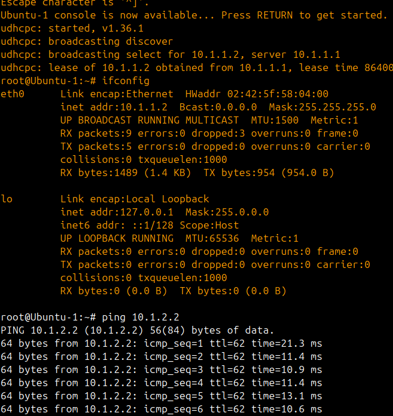
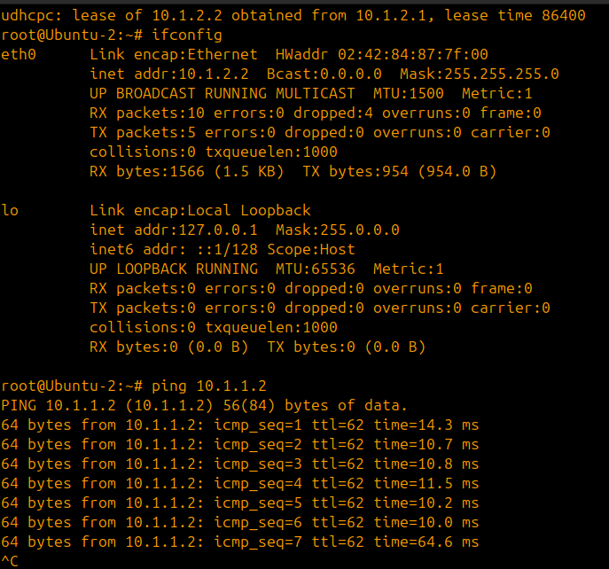

### Conclusion
This lab provided a practical walkthrough for configuring and verifying a GRE tunnel in a GNS3 environment. We achieved the primary objective of establishing routable connectivity between two remote networks across an intermediary "ISP" network using GRE encapsulation. Verification steps, including ping and traceroute, confirmed the tunnel's functionality.

### Future Work:
To further enhance this lab and deepen understanding, the following could be explored:
* **IPsec Integration:** Implement IPsec over the GRE tunnel to add encryption and authentication, transforming it into a secure VPN solution.
* **Dynamic Routing:** Configure a dynamic routing protocol (e.g., OSPF or EIGRP) to advertise routes across the GRE tunnel, demonstrating automatic route discovery.
* **Advanced Tunneling:** Investigate other tunneling protocols like DMVPN or VTI for more scalable and flexible VPN designs.
